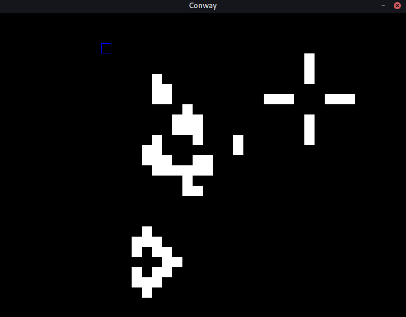

# Conway

This is a straightforward implementation of [Conway's Game of Life](https://www.wikiwand.com/en/Conway%27s_Game_of_Life), as
a graphical application, using SDL2 and Haskell.



# Controls

| Key     | Effect                |
|---------|-----------------------|
| Escape  | Quit the game         |
| Space   | Pause / Unpause       |
| Click   | Make a cell alive     |
| S       | Advance the game once |
| A       | Increase game speed   |
| D       | Decrease game speed   |

# Installation

The main prerequisites are having Haskell, along with Cabal, as well as the [SDL2 Library](https://www.libsdl.org/). After having installed
those, simply runnning:

```
cabal run
```

in this folder should start the game just fine.

If you'd like to install this game permanently, `cabal install` should work as well.
